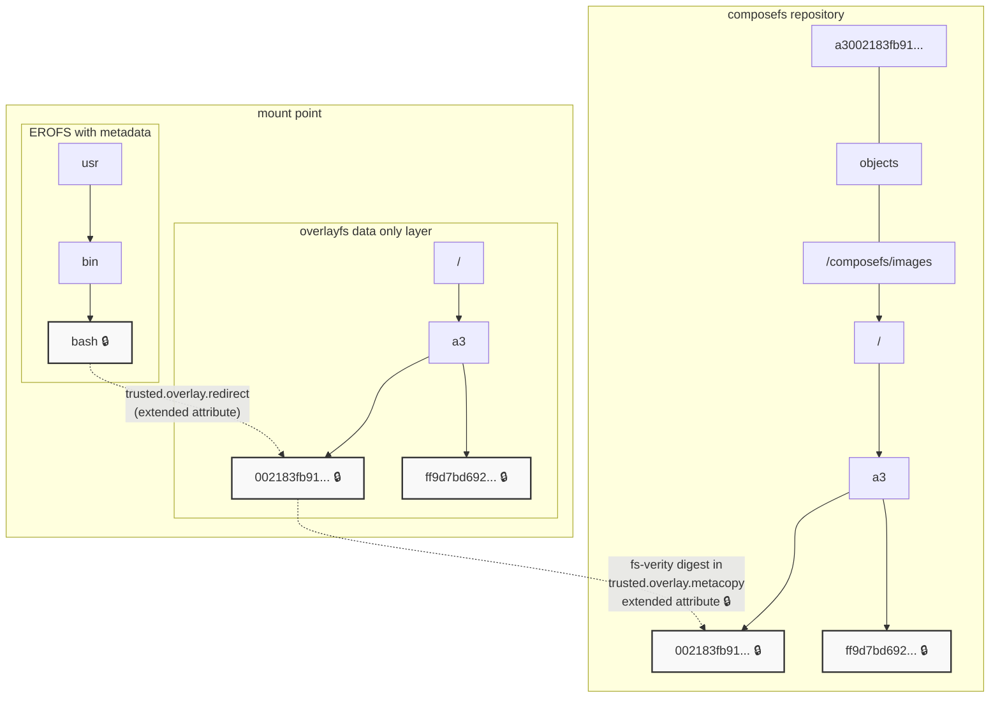

# Hardening Operating System Distribution: Verifiable and sealed OS with bootc and composefs

Devconf.cz 2026
Colin Walters, Red Hat

---

## Background

- OSTree -> composefs!
- Integrity is important
- Control of local mutable state

---

## Threat scenarios

- Attacker with physical access to block device of non-booted (or locked) system ("Evil maid")
- Confidental computing (can change live block device)

---

## composefs

- Verified storage is hard
- partition dm-verity has logistic constraints
- loopback-mounted dm-verity is not efficient
- And impedance mismatch between dm-verity and containers

## composefs

- EROFS
- overlayfs
- fsverity
- Any backing Linux filesystem you want with whatever block device you want (plain ext4, btrfs, XFS on LUKS, dm-crypt, RAID, ...)

## Architecture

---

## Building your own

- <https://github.com/redhat-cop/rhel-bootc-examples/tree/main/sealing>

## Demo!

- Walkthrough of build and booted system

---

## Understanding use cases and security

- Full disk LUKS *just works*
- Can also use dm-integrity

---

## What's next?

- composefs-rs 1.0
- Reimplementing composefs v1 format in Rust: predictable digests
- On disk format stable
- Eventually replacing the C composefs implementation
- varlink APIs