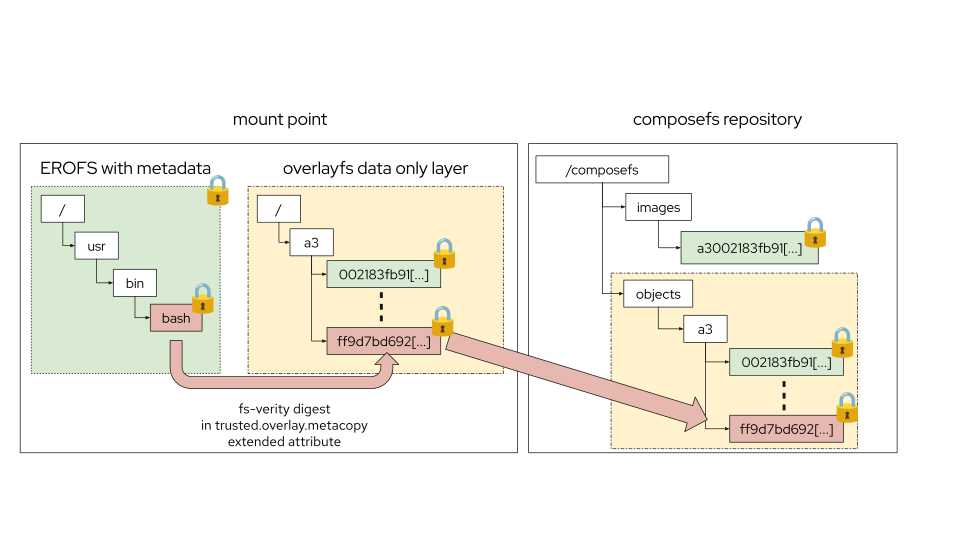

# Hardening Operating System Distribution: Verifiable and sealed OS with bootc and composefs

Devconf.cz 2026
Colin Walters, Red Hat

---

## Agenda

- Why: Operating system security
- What is composefs, the last ~year of development
- Demo of RHEL 10.2 as sealed "only state you want" system
- What's next?

---

## Computers: oops

- We invented computers, now we need to keep them updated and secure
- Operating system is at the nexus
  - OS vs 3rd party apps, major versions, attack surface
  - Mutable vs "immutable" (controlled state)

---

## Threat scenarios

- Attacker with physical access to block device of non-booted (or locked) system 
  - Physical attacker mounts disk ("Evil maid")
  - Hypervisor: Confidental computing
- Container image (or other isolation) breakout - avoid persistence across reboot
---

## Why composefs

- Storage is hard
- partition dm-verity has logistical issues, loopback-mounted dm-verity is not efficient
- And impedance mismatch between dm-verity and OCI containers
- composefs: Shared storage on disk and in page cache, automatic dedup

---

## composefs ingredients

- 3 big parts: (metadata-only) EROFS + overlayfs + fsverity
- Any backing Linux filesystem you want with whatever block device you want (plain ext4, btrfs, XFS on LUKS, dm-crypt, RAID, ...)
- In a nutshell: verified storage independent of (lower) filesystem and block

---

## Architecture of a composefs image + repo



## Architecture of a composefs repo

- Holds multiple images (metadata EROFS)
- Object store for shared backing files named by fsverity digest

---

## composefs implementations and ecosystem

- <https://github.com/composefs/composefs> is C impl, <https://github.com/composefs/composefs-rs> is Rust (taking over C impl)
- Rust impl also much higher level, has opinionated OCI, also initramfs handling.
- Also part of CNCF

---

## Where is composefs used?

- bootc
- [rauc.io](https://rauc.io)
- podman (optionally, ~experimental)
- Lots of custom/private things we mainly see because of bug reports/features
  - e.g. I realized we need a build of bootc without ostree support
---

## Building your own sealed UKI RHEL Image Mode

- <https://github.com/redhat-cop/rhel-bootc-examples/tree/main/sealing>
- Let's dive in!
- (Quick shell command)

---

## Ingredient: Your own Secure Boot keys

- `just keygen` wraps python script running openssl; some small tweaks here
- Standin for e.g. HSM in production
- Stock general purpose OS boot chain: Microsoft signs shim, which trusts other keys for Fedora, Debian, RHEL etc.
- *Important*: Firmware must have your key enrolled (out of band or interactively via e.g. systemd-boot)
- That said, we are also working to support shim-based flows

---

## Ingredient: Multi-stage container build

- Uses stock rhel-bootc container image as builder
- Generate "from scratch" rootfs (your arbitrary content)

```
# You may also want to use e.g. --install to add extra packages here.
FROM base AS target-base
...
RUN --mount=type=tmpfs,target=/run --mount=type=tmpfs,target=/tmp \
    /usr/libexec/bootc-base-imagectl build-rootfs --manifest=standard /target-rootfs
```

---

## Ingredient: Secure boot keys sign systemd-boot

```
FROM base-rootfs AS penultimate
RUN --mount=type=secret,id=secureboot_key \
    --mount=type=secret,id=secureboot_cert <<EORUN
set -xeuo pipefail
/usr/lib/systemd/systemd-sbsign sign \
    --private-key /run/secrets/secureboot_key \
    --certificate /run/secrets/secureboot_cert \
    --output /tmp/systemd-bootx64.efi.signed \
    /usr/lib/systemd/boot/efi/systemd-bootx64.efi
```

---

## Ingredient: Create and sign UKI via bootc container ukify

- Unified Kernel Images are a standard created by systemd project
- `bootc container ukify`: Wraps `ukify` to handle composefs digest injection
  - 🆕 This computation is a lot faster and more efficient now!

---

## Ingredient: Create and sign UKI via bootc container ukify

```
FROM tools AS sealer
RUN --mount=type=bind,from=penultimate,target=/target \
    --mount=type=secret,id=secureboot_key \
    --mount=type=secret,id=secureboot_cert <<EORUN
...
bootc container ukify --rootfs /target \
  --karg rw \
  -- \
  --signtool systemd-sbsign \
  --secureboot-private-key /run/secrets/secureboot_key \
  --secureboot-certificate /run/secrets/secureboot_cert \
  --no-sign-kernel \
  --output /out/uki.efi
```

---

## Combining build ingredients!

```
FROM penultimate
# The last layer: copy in our UKI from the sealer build stage
COPY --from=sealer /out/boot /boot
# Required + suggested metadata
LABEL containers.bootc 1
ENV container=oci
STOPSIGNAL SIGRTMIN+3
CMD ["/sbin/init"]
```

---

## Aside: Wait how does this work

- A container image that has its own digest? Is it a "Hashquine"?


- No, the trick is: `bootc container ukify` omits `/boot` where the UKI goes
- Which pairs with the `COPY --from=sealer /out/boot /boot` 

---

## Another aside: The "magic trick" of reproducible EROFS

- Constraint: Can't fundamentally change OCI representation or would break ecosystem
- The composefs (EROFS) is computed on the server (given a mounted filesystem inside container runtime)
- Then re-generated on the client from the tar streams - in other words, it just looks like any other OCI image on the wire
- Requirement: we need to nail down an exact reproducible frozen format (actually there's two, that's another story)

---

## Ingredient: bootc

- `bootc` wraps composefs-rs for both install and upgrade
- OCI image is fetched, we convert tar layers into composefs object store and synthesize the EROFS
- `bootc install to-filesystem` and `bootc upgrade` copies the embedded UKI to ESP


---

## Ingredient: bcvk - local qemu+libvirt with bootable containers

- Neato tool if I do say so myself (and I just did!)
- `bcvk ephemeral` helps bootstrap persistent installs
- `bcvk libvirt run` conveniently wraps `bootc install` to qcow2 + launch libvirt
- Supports being passed secure boot keys

---

## More Demos

- Let's launch an install with an incorrect `composefs=`
- Inspect `/sysroot` including `/state`
- Inspect `/boot` (loader and EFI)

---

## More things you can do: Configuring bootc state

Achieve: "Stateless except OS upgrades"

```
$ cat /usr/lib/composefs/setup-root-conf.toml
[etc]
mount = "transient"
[var]
mount = "none"
$ cat /usr/lib/bootc/kargs.d/50-var-volatile.toml
kargs = ["systemd.volatile=state"]
$
```

---

## What else has happened and is next?

- ✅ Reimplementing composefs v1 format in Rust: predictable digests
- ✅ On disk format stable
- varlink APIs (in progress)
- Eventually replacing the C composefs implementation
- Opt-in support for ostree fetching+storage to transition existing tooling
- composefs-rs 1.0 (soon!)

---

## And even more?

- bootc: Unified storage
  - Shifting things so that we pull *first* into composefs repo, then reflink into ostree
  - Also supporting pulling via podman pull, then reflink into composefs!
  - This ties with earlier varlink work; `splitfdstream` as generic reflinkable (container) interchange
- 🆒 Generic sealed (non-bootable) container images
  - OCI artifact with composefs digest + fsverity signatures: covers manifest+config+root

---

## Links and thanks!

- <https://github.com/redhat-cop/rhel-bootc-examples>
- <https://github.com/composefs/composefs-rs/>
- <https://bootc.dev>
- Thank you!